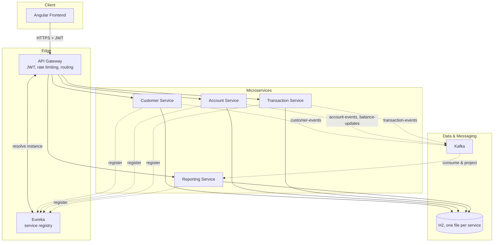
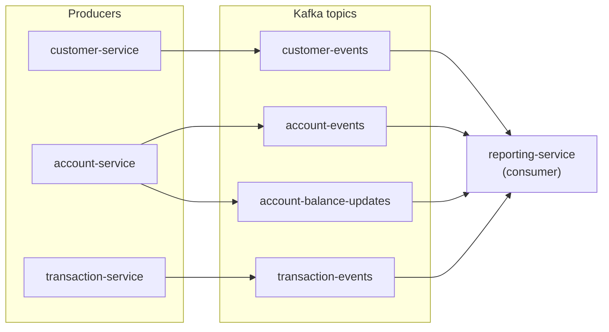
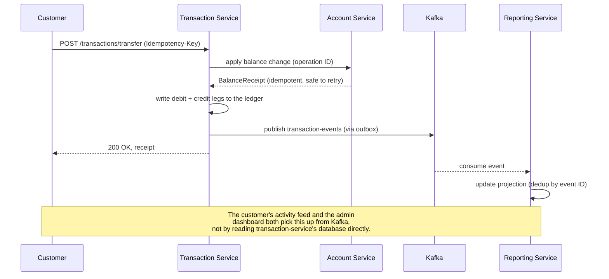

<div align="center">

# E-Bank

**A full-stack digital banking platform: Spring Boot microservices, Kafka event streaming, and an Angular front end.**

[](#tech-stack)
[](#tech-stack)
[](#tech-stack)
[](#kafka--event-driven-architecture)
[](#quick-start)
[](LICENSE)

*Five independently deployable services, coordinated through an API gateway and Eureka, kept eventually consistent through Kafka, with a real double-entry ledger reconciliation you can watch balance in real time.*

</div>

---

## Screenshots

<table>
<tr><td width="22%"><b>Landing / sign in</b><br/><sub>The public entry point, with quick demo-account buttons.</sub></td>
<td></td></tr>
<tr><td><b>Admin dashboard</b><br/><sub>Live customer, account and balance stats, plus a real ledger reconciliation status.</sub></td>
<td></td></tr>
<tr><td><b>Admin reports</b><br/><sub>PDF/CSV reports rendered as real tables, not JSON dumps.</sub></td>
<td></td></tr>
<tr><td><b>Customer accounts</b><br/><sub>A customer's own accounts, balances and recent activity.</sub></td>
<td></td></tr>
<tr><td><b>Customer transaction history</b><br/><sub>Filterable, paginated history with export.</sub></td>
<td></td></tr>
<tr><td><b>Kafka, visualized</b><br/><sub>Live topics and message counts in <a href="https://github.com/provectus/kafka-ui">Kafka UI</a>.</sub></td>
<td></td></tr>
</table>

---

## Table of contents

- [What this is](#what-this-is)
- [Features](#features)
- [Tech stack](#tech-stack)
- [Architecture](#architecture)
- [The microservices](#the-microservices)
- [Kafka & event-driven architecture](#kafka--event-driven-architecture)
- [Watching Kafka work](#watching-kafka-work)
- [Money movement, correctness, and the ledger](#money-movement-correctness-and-the-ledger)
- [Service discovery (Eureka)](#service-discovery-eureka)
- [Quick start](#quick-start)
- [Demo credentials](#demo-credentials)
- [Verifying it yourself](#verifying-it-yourself)
- [Project layout](#project-layout)
- [License](#license)

---

## What this is

E-Bank is a demo digital bank built the way a real one would be structured: separate
services for customers, accounts, transactions and reporting, talking to each other
over HTTP for requests that need an answer right away, and over **Kafka** for
everything that can happen asynchronously downstream. It ships with 50 realistic
demo customers, 7 months of reconciled transaction history, an admin back office,
and a customer-facing web app, all runnable with a single `docker compose` command.

It's meant to be a portfolio-grade example of:
- designing a **microservices** system with clear service boundaries and a gateway,
- using **Kafka** for real event-driven communication, not just as a buzzword,
- keeping money movement **correct** under concurrency (idempotency keys, an
  outbox pattern, and a reconciliation report that actually checks the ledger),
- and packaging all of that so anyone can `docker compose up` and see it work.

## Features

- **Customer banking**: current & savings accounts, deposits, withdrawals, transfers,
  paginated transaction history with filters, CSV export.
- **Admin back office**: manage customers and accounts, review every transaction,
  generate PDF/CSV reports with real tables.
- **Ledger reconciliation**: every account's balance is checked against the sum of
  its own ledger entries; the admin dashboard shows live `BALANCED` / `MISMATCH` status.
- **Transfer audit trail**: every transfer's two legs (debit and credit) are linked
  back to the single request that created them, so you can see exactly what happened.
- **Kafka-driven activity feed**: a customer's dashboard is notified of new activity
  through events consumed off Kafka, not a direct database read.
- **Idempotent money commands**: retrying a `credit`, `debit` or `transfer` with the
  same `Idempotency-Key` is always safe, even under heavy concurrent retries.
- **Broker-outage resilience**: an outbox pattern means a paused Kafka broker never
  blocks a money command; events are delivered once the broker comes back.
- **JWT auth** with role-based access (`ADMIN` / `CUSTOMER`), rate limiting, and CORS
  handled at the gateway.

## Tech stack

| Layer | Technology |
|---|---|
| Frontend | Angular 19, Bootstrap 5, Chart.js, jsPDF |
| API Gateway | Spring Cloud Gateway, JWT filter, rate limiting |
| Services | Spring Boot 3.2 / Java 21, Spring Data JPA, OpenFeign |
| Service discovery | Netflix Eureka |
| Messaging | Apache Kafka 7.5 (Confluent), Kafka UI for visualization |
| Databases | H2 (one file-backed database per service: real isolation, zero setup) |
| Testing | JUnit 5, Mockito, Playwright (desktop and mobile), Python verification scripts |
| Packaging | Docker Compose (one file for the whole stack) |

## Architecture

Each service owns its own database; there is no shared schema. Services that need
data from another service either call it synchronously over HTTP (through the
gateway or Feign, when the answer is needed immediately) or read it asynchronously
off Kafka (when the reaction can happen a moment later).



**Why this shape?** A request that a user is waiting on (log in, submit a transfer)
goes straight through the gateway to the owning service and back: synchronous,
predictable, easy to reason about. Anything a *different* part of the system only
needs to *know about eventually* (reporting dashboards, the activity feed) goes
through Kafka instead, so the transaction service never has to wait on, or fail
because of, the reporting service being slow or down.

## The microservices

| Service | Port | Responsibility |
|---|---|---|
| **discovery-service** | 8761 | Eureka registry. Every other service registers here; the gateway asks it who `account-service` is right now. |
| **gateway-service** | 8080 | Single entry point. Validates the JWT, rate-limits, and routes `/api/**` to the right service via Eureka. |
| **customer-service** | 8081 | Auth (login/register), user and customer records. Publishes `customer-events`. |
| **account-service** | 8082 | Current and savings accounts, balances. Applies money commands idempotently (a `BalanceReceipt` keyed by operation ID). Publishes `account-events` and `account-balance-updates`. |
| **transaction-service** | 8083 | Credit/debit/transfer commands, the operation ledger, transfer audit trail. Publishes `transaction-events`. |
| **reporting-service** | 8084 | Consumes every topic above and maintains read-optimized projections for dashboards, reports, the reconciliation check, and the customer activity feed. |

A request for `/api/accounts/{id}` goes **Frontend to Gateway to Eureka (resolve) to
account-service and back**. Nothing is proxied blind; the gateway always asks Eureka
which instance is currently healthy before forwarding.

## Kafka & event-driven architecture

**Kafka** is a durable, ordered log that services write events to (produce) and
read events from (consume), without calling each other directly. Here it's what
makes the system **event-driven**: when something happens (an account is created,
a balance changes, a transfer completes), the service that did it publishes one
event, and anything that cares can react on its own time.



**How a transfer actually flows through it**, end to end:



Two details worth calling out because they're easy to get wrong in a demo project:

- **Durability across a broker outage.** Money commands don't call Kafka directly.
  They write to a local **outbox table** in the same database transaction as the
  balance change, and a background relay delivers outbox rows to Kafka with retry.
  Pause the Kafka container mid-transfer and the transfer still completes; the event
  is delivered the moment the broker comes back. `scripts/verify-kafka-recovery.py`
  proves this against the running stack.
- **Exactly-once projections.** `reporting-service` deduplicates by event ID and
  rejects stale or out-of-order snapshots, so replaying the same event, or restarting
  reporting-service and replaying its Kafka topics from scratch, never double-counts
  a balance or a transaction.

## Watching Kafka work

The stack ships with [Kafka UI](https://github.com/provectus/kafka-ui) at
**http://localhost:19090**, a web dashboard for the broker itself. You can watch
topics fill up in real time as you use the app: log in as a customer, submit a
transfer, and watch `transaction-events` and `account-balance-updates` grow by one
message each, then watch reporting-service's dashboard and activity feed update a
moment later. It's the easiest way to actually see the event-driven part working,
rather than take it on faith.

## Money movement, correctness, and the ledger

Every account's balance must equal the sum of its own ledger entries, including
its opening deposit, which is itself recorded as a transaction. The admin dashboard
calls `/api/reports/reconciliation`, which recomputes that sum for every account and
reports `BALANCED` or lists exactly which accounts and by how much they're off.

Money commands (`credit`, `debit`, `transfer`) take an `Idempotency-Key` header.
Retrying the same key is always safe, even eight truly concurrent retries with the
same key, hammering the same account, resolve to exactly one applied change and one
ledger entry. That's enforced two ways: `account-service` keeps a `BalanceReceipt`
keyed by operation ID (so re-applying is a no-op), and `transaction-service` treats
that receipt as the single source of truth for whether it should write a new
ledger row, backed by a database-level unique constraint as a hard guarantee, not
just an in-memory lock.

## Service discovery (Eureka)

Every service (except discovery-service itself) registers with **Eureka** on
startup and sends heartbeats. The gateway asks Eureka to resolve `lb://account-service`
into a live instance before forwarding a request, so if you scaled `account-service`
to two instances, the gateway would load-balance across both automatically, and a
crashed instance would drop out of rotation once its heartbeat lapses.

## Quick start

```bash
git clone <this-repo>
cd Digital-Banking
docker compose up -d --build
```

That's it: one command builds all five services and the frontend, starts
Zookeeper, Kafka and Kafka UI, and seeds 50 demo customers with 7 months of
reconciled transaction history. Give it a minute or two for everything to report
healthy (`docker compose ps`), then open:

| | |
|---|---|
| App | http://localhost:4200 |
| Gateway (API) | http://localhost:18080 |
| Eureka | http://localhost:18761 |
| Kafka UI | http://localhost:19090 |

- `docker compose down` stops everything and **keeps** the demo data.
- `docker compose down -v` also wipes the named volumes for a clean-slate demo.
- All ports are configurable via `.env` (see `.env.example`) and bind to
  `127.0.0.1` by default.

## Demo credentials

| Role | Username | Password |
|---|---|---|
| Admin | `admin` | `password` |
| Customer | `marie.dupont` (or any seeded customer) | `password` |

## Verifying it yourself

The `scripts/` folder has Python scripts that exercise the running stack the same
way this README's claims were checked while writing it:

| Script | What it proves |
|---|---|
| `verify-demo-data.py` | 50 customers, 50 accounts, 1,100 operations, every account reconciled |
| `verify-kafka-recovery.py` | a broker outage never blocks or loses a money command |
| `verify-kafka-dlt.py` | a malformed event lands on the dead-letter topic instead of crashing a consumer |
| `verify-api-load.py` | a bounded concurrent read-load check with p50/p95/max latency |
| `generate-demo-data.py` | regenerates the seed dataset (accounts and operations, pre-reconciled) |

```bash
python3 scripts/verify-demo-data.py --base-url http://localhost:4200
```

## Project layout

```
Digital-Banking/
├── docker-compose.yml            # the whole stack, one command
├── frontend/                     # Angular app (admin + customer portals)
├── microservices/
│   ├── discovery-service/        # Eureka
│   ├── gateway-service/          # routing, JWT, rate limiting
│   ├── customer-service/         # auth, customers
│   ├── account-service/          # accounts, balances, idempotent money commands
│   ├── transaction-service/      # ledger, transfers, audit trail
│   └── reporting-service/        # Kafka consumer, dashboards, reconciliation
├── scripts/                      # Python verification and demo-data scripts
└── docs/                         # screenshots, architecture notes, test evidence
```

Each service's own `src/main/java/.../` follows the same shape: `controllers/` to
`services/` to `repositories/`/`entities/`, with `clients/` for Feign calls to
other services, `messaging/` for Kafka producers/consumers, and `config/` for
demo-data loaders and infrastructure wiring.

## License

MIT, see [LICENSE](LICENSE).
Thanks for checking out this project.
